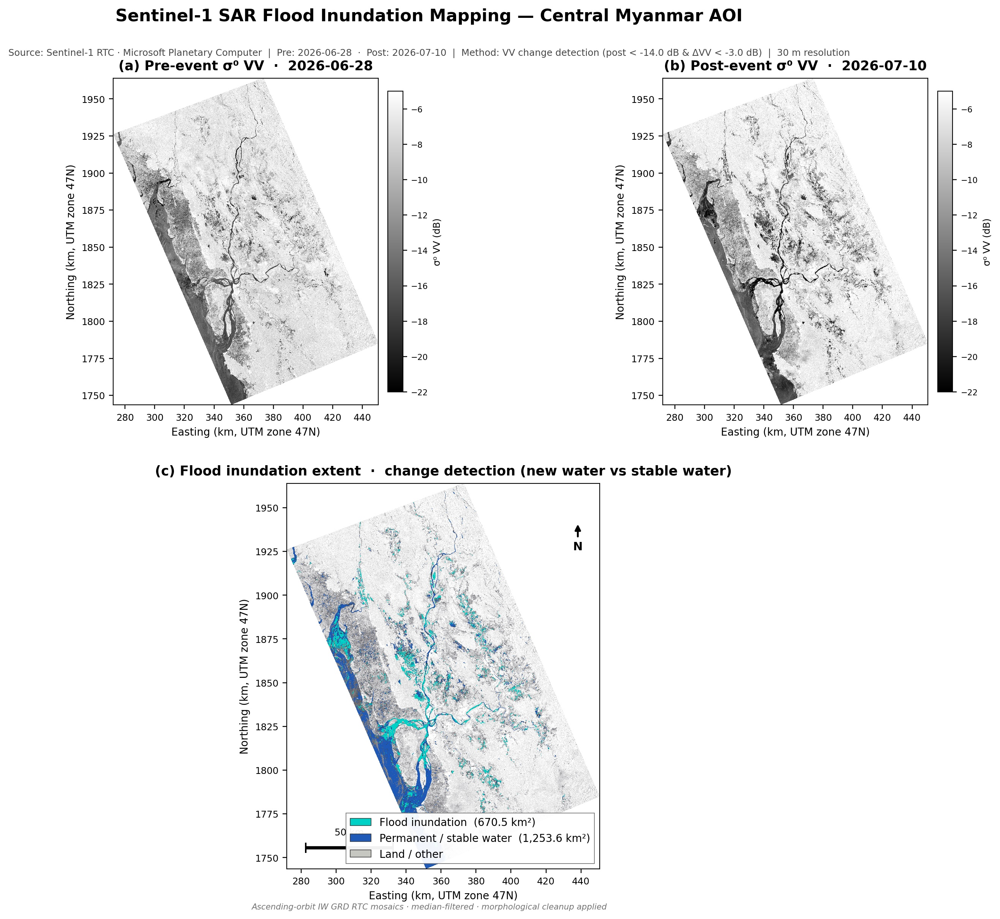

# Sentinel-1 SAR Flood Inundation Mapping

[](https://www.python.org/downloads/)
[](LICENSE)
[](https://planetarycomputer.microsoft.com/)
[](https://planetarycomputer.microsoft.com/dataset/sentinel-1-rtc)

Open, reproducible workflow to **download Sentinel-1 Radiometrically Terrain Corrected (RTC) SAR data** from the [Microsoft Planetary Computer](https://planetarycomputer.microsoft.com/), **map flood inundation** with VV backscatter change detection, and **export a publication-ready map**.

| | |
|---|---|
| **Study area** | Central Myanmar (user-defined AOI) |
| **Pre-event** | 28 June 2026 |
| **Post-event** | 10 July 2026 |
| **Flood area (default run)** | **670.5 km²** |
| **Method** | VV dB change detection (new water vs stable water) |

<p align="center">
  
</p>

<p align="center"><em>Figure 1. Pre-event VV, post-event VV, and flood inundation classification for the study AOI.</em></p>

---

## Table of contents

- [Overview](#overview)
- [Key results](#key-results)
- [Repository structure](#repository-structure)
- [Requirements](#requirements)
- [Quick start](#quick-start)
- [Configuration](#configuration)
- [Method summary](#method-summary)
- [Outputs](#outputs)
- [Data attribution](#data-attribution)
- [Limitations](#limitations)
- [Documentation](#documentation)
- [Citation](#citation)
- [Contributing](#contributing)
- [License](#license)

---

## Overview

Floods are among the most frequent and damaging natural hazards. Optical satellites are often blocked by cloud during monsoon events; **C-band SAR** from Sentinel-1 continues to observe the surface through cloud and at night. Open water appears **dark** in co-polarized VV backscatter. By comparing a **pre-event** image with a **post-event** image, this project maps **new inundation** while treating surfaces that are dark on both dates as **permanent or stable water**.

The pipeline is intentionally compact (single main script) so it can be read, audited, and adapted for other dates or regions.

**What this repository provides**

- End-to-end STAC → process → map workflow  
- Default AOI and dates with archived figure and classification products  
- Detailed methodology, data attribution, and citation metadata for publication  

---

## Key results

Default configuration (`flood_inundation_s1.py`, AOI in `data/aoi.geojson`):

| Metric | Value |
|--------|------:|
| Flood inundation | **670.5 km²** |
| Permanent / stable water | **1,253.6 km²** |
| Analysis resolution | 30 m |
| CRS | EPSG:32647 (UTM 47N) |
| Water threshold \(T_w\) | −14.0 dB |
| Change threshold \(\Delta\)VV | −3.0 dB |
| Collection | `sentinel-1-rtc` |

Per-date coverage: **two** ascending IW RTC tiles mosaicked for each of 2026-06-28 and 2026-07-10 (Sentinel-1D). Scene IDs are listed in [`outputs/stac_items.json`](outputs/stac_items.json) and [`docs/METHODOLOGY.md`](docs/METHODOLOGY.md).

---

## Repository structure

```text
.
├── README.md                 # This file
├── LICENSE                   # MIT (code); data terms noted separately
├── CITATION.cff              # GitHub / software citation metadata
├── CONTRIBUTING.md           # Contribution guidelines
├── requirements.txt          # Python dependencies
├── flood_inundation_s1.py    # Main pipeline
├── data/
│   └── aoi.geojson           # Area of interest
├── docs/
│   ├── METHODOLOGY.md        # Full scientific/technical method
│   └── DATA_SOURCES.md       # Data licences and attribution
└── outputs/
    ├── README.md             # Output catalogue
    ├── flood_inundation_map.jpg
    ├── flood_inundation_map.png
    ├── flood_classification.tif
    ├── flood_stats.json
    └── stac_items.json
```

Large intermediate arrays (`outputs/vv_db.npz`) are **gitignored** and regenerated when you run the script.

---

## Requirements

- **Python 3.11 or 3.12** (3.10 may work; not continuously tested)
- Internet access to:
  - `https://planetarycomputer.microsoft.com` (STAC API)
  - Azure Blob hosts serving signed Sentinel-1 COGs
- ~4–8 GB RAM recommended for the default AOI at 30 m
- Disk: a few hundred MB during download; optional `vv_db.npz` cache ~100+ MB

No Planetary Computer API key is required for standard STAC search and signed asset download.

### Python packages

Install from [`requirements.txt`](requirements.txt):

```text
numpy, scipy, matplotlib, scikit-image, shapely,
rasterio, pystac-client, planetary-computer
```

---

## Quick start

```bash
# 1. Clone
git clone https://github.com/USERNAME/REPO.git
cd REPO

# 2. Environment
python -m venv .venv
source .venv/bin/activate          # Windows: .venv\Scripts\activate
pip install -r requirements.txt

# 3. Run flood mapping (downloads S1 RTC, processes, writes outputs/)
python flood_inundation_s1.py
```

Runtime depends on network and machine; for the default AOI expect on the order of **10–20 minutes** on a typical cloud VM (dominated by COG reads and reprojection).

### Using only the published products

If you do not need to re-download:

- View the map: [`outputs/flood_inundation_map.jpg`](outputs/flood_inundation_map.jpg)
- Open the classification in QGIS/ArcGIS: [`outputs/flood_classification.tif`](outputs/flood_classification.tif)
- Read areas: [`outputs/flood_stats.json`](outputs/flood_stats.json)

---

## Configuration

Edit the constants at the top of [`flood_inundation_s1.py`](flood_inundation_s1.py):

| Parameter | Default | Description |
|-----------|---------|-------------|
| `AOI` | Myanmar polygon | GeoJSON-like polygon (WGS84 lon/lat) |
| `PRE_DATE` | `2026-06-28` | Pre-event date (UTC calendar day) |
| `POST_DATE` | `2026-07-10` | Post-event date |
| `COLLECTION` | `sentinel-1-rtc` | Planetary Computer STAC collection |
| `TARGET_RES_M` | `30` | Analysis resolution (metres) |
| `CHANGE_DB` | `-3.0` | Minimum pre→post VV decrease (dB) for flood |
| `MIN_FLOOD_PIXELS` | `40` | Minimum object size after cleanup |
| `SPEC_SIZE` | `3` | Median filter window |
| `EPSG_UTM` | `32647` | Target projected CRS |

The same AOI is stored as [`data/aoi.geojson`](data/aoi.geojson) for GIS use. Keep the script `AOI` and GeoJSON in sync when you change the study area.

**Tips for other regions**

1. Replace `AOI` / `data/aoi.geojson`.  
2. Set `EPSG_UTM` to the appropriate UTM zone (or another projected CRS in metres).  
3. Search available dates on the [Planetary Computer Explorer](https://planetarycomputer.microsoft.com/explore) or via `pystac_client`.  
4. Prefer **same orbit geometry** (ascending vs descending) for pre and post.  
5. Inspect panels (a) and (b) and adjust `CHANGE_DB` / water-threshold clips if needed.

---

## Method summary

```text
STAC search → sign COGs → mosaic VV → dB → median filter
    → water threshold → ΔVV change rule → morphology → map export
```

**Flood pixel** (simplified):

1. Post-event VV is below a water threshold \(T_w\) (Otsu on the low-backscatter regime, constrained to [−18, −14] dB → **−14 dB** in the default run).  
2. Backscatter **decreases** from pre to post by at least **3 dB**.  
3. Stable dark water (dark on both dates with small \(\lvert\Delta\mathrm{VV}\rvert\)) is labelled **permanent / stable water**, not flood.

Full equations, processing parameters, scene IDs, limitations, and references: **[`docs/METHODOLOGY.md`](docs/METHODOLOGY.md)**.

---

## Outputs

| File | Description |
|------|-------------|
| [`outputs/flood_inundation_map.jpg`](outputs/flood_inundation_map.jpg) | Publication multi-panel map (primary deliverable) |
| [`outputs/flood_inundation_map.png`](outputs/flood_inundation_map.png) | PNG version of the same figure |
| [`outputs/flood_classification.tif`](outputs/flood_classification.tif) | GeoTIFF classes: `1` = flood, `2` = permanent water, `0` = other |
| [`outputs/flood_stats.json`](outputs/flood_stats.json) | Areas (km²), thresholds, pixel counts |
| [`outputs/stac_items.json`](outputs/stac_items.json) | STAC item IDs used for the run |

See [`outputs/README.md`](outputs/README.md) for class table and notes.

---

## Data attribution

Please credit the original data providers in any publication, presentation, or web map:

> Contains modified **Copernicus Sentinel** data [2026].  
> Data accessed through the **Microsoft Planetary Computer**.

Details and links: [`docs/DATA_SOURCES.md`](docs/DATA_SOURCES.md).

---

## Limitations

- Threshold-based SAR flood maps can miss **flooded vegetation** and misclassify some **urban / bare flat** surfaces.  
- Only **two dates** are used; multi-temporal baselining can improve stability.  
- No DEM/HAND or external permanent-water layer is applied in the default pipeline.  
- Results are **not** a substitute for official emergency mapping services without local validation.  

These points are expanded in the methodology document.

---

## Documentation

| Document | Content |
|----------|---------|
| [docs/METHODOLOGY.md](docs/METHODOLOGY.md) | Full method, parameters, results, references |
| [docs/DATA_SOURCES.md](docs/DATA_SOURCES.md) | Licences and attribution wording |
| [outputs/README.md](outputs/README.md) | Output file catalogue |
| [CONTRIBUTING.md](CONTRIBUTING.md) | How to contribute |
| [CITATION.cff](CITATION.cff) | Citation metadata |

---

## Citation

If you use this code or the derived maps, please cite the repository (update author and URL in `CITATION.cff` before publishing):

```bibtex
@software{s1_flood_inundation_2026,
  title     = {Sentinel-1 SAR Flood Inundation Mapping with Microsoft Planetary Computer},
  version   = {1.0.0},
  year      = {2026},
  url       = {https://github.com/USERNAME/REPO},
  note      = {Contains modified Copernicus Sentinel data [2026],
               accessed via the Microsoft Planetary Computer.}
}
```

GitHub users can also use **Cite this repository** once `CITATION.cff` is present on the default branch.

---

## Contributing

Bug reports, improved thresholds, DEM/HAND masks, multi-date baselines, and documentation fixes are welcome. See [`CONTRIBUTING.md`](CONTRIBUTING.md).

---

## License

- **Source code and documentation** in this repository: [MIT License](LICENSE).  
- **Satellite data** remain under Copernicus and Planetary Computer terms (see [LICENSE](LICENSE) data note and [docs/DATA_SOURCES.md](docs/DATA_SOURCES.md)).

---

## Acknowledgements

- [European Space Agency / Copernicus](https://www.copernicus.eu/) — Sentinel-1 mission  
- [Microsoft Planetary Computer](https://planetarycomputer.microsoft.com/) — open STAC access to analysis-ready SAR  
- Open-source ecosystem: `pystac-client`, `rasterio`, `scikit-image`, and related libraries  

---

**Primary deliverable:** [`outputs/flood_inundation_map.jpg`](outputs/flood_inundation_map.jpg)
